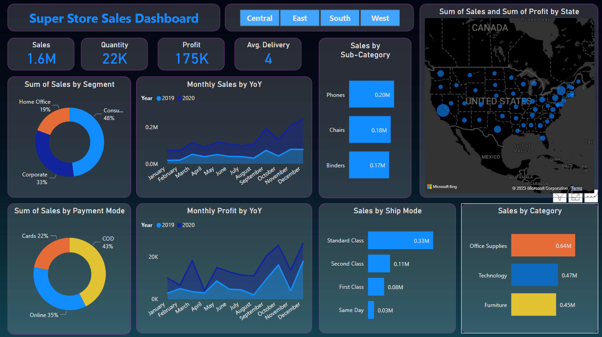

# 📈 Power BI Sales Dashboard

This project presents an interactive **Sales Dashboard** built using **Power BI** to analyze and visualize sales data. It helps businesses track KPIs such as total revenue, profit, region-wise performance, and product/category trends over time.

## 📊 Power BI Dashboard Preview




## 📊 Key Features

- Total Sales, Profit, Quantity KPIs
- Region-wise and Category-wise breakdown
- Top-performing products and sub-categories
- Time-based sales trends using slicers
- Clean and dynamic Power BI visuals

## 📁 Project Structure

```
POWER-BI-SALESBOARD/
├── Sales_Dashboard.pbix          # Power BI dashboard file
├── sales_data.xlsx               # Source sales data
└── README.md                     # Project documentation
```

## ⚙️ Tools & Technologies Used

- **Power BI Desktop**
- **DAX** (Data Analysis Expressions)
- **Power Query Editor**
- **Excel** for data preparation

## 🚀 How to Use

1. **Clone the repository** or download the ZIP:
   ```bash
   git clone https://github.com/richanshu14/POWER-BI-SALESBOARD.git
   ```

2. **Open the `.pbix` file** using Power BI Desktop:
   - Navigate to `Sales_Dashboard.pbix`
   - Explore and interact with the report pages using slicers and visuals

3. **Modify the data**:
   - Use `sales_data.xlsx` to update the raw data
   - Refresh in Power BI to update visuals


## 📌 Use Cases

- Business sales performance tracking
- BI project for portfolio or interview
- Learning Power BI for data visualization

## 🧑‍💻 Author

**Richanshu Yadav**  
[GitHub Profile](https://github.com/richanshu14)

